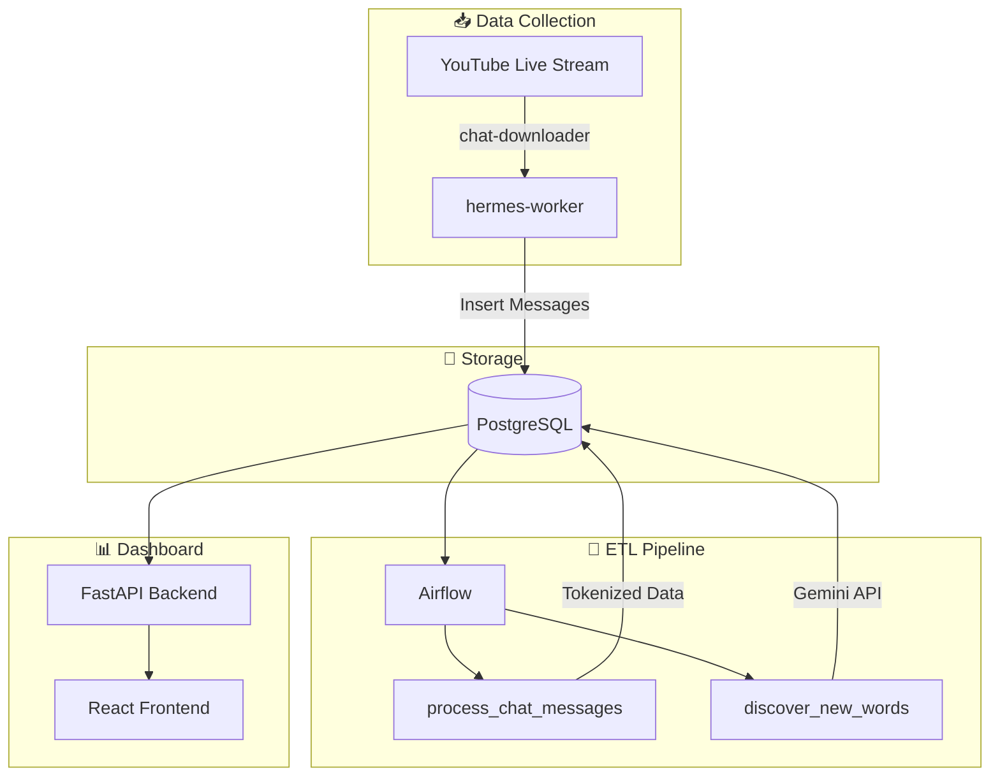

<p align="center">
  
</p>

<h1 align="center">⚡ Hermes</h1>

<p align="center">
  <strong>YouTube Live Stream Chat Collection & Analysis System</strong>
</p>

<p align="center">
  <a href="#"></a>
  <a href="#"></a>
  <a href="#"></a>
  <a href="#"></a>
  <a href="#"></a>
  <a href="#"></a>
  <a href="#"></a>
</p>

---

## 🪽 What is Hermes?

**Hermes** — named after the Greek god of messages and communication — is a complete data pipeline for collecting, processing, and visualizing YouTube live stream chat messages in real-time.

The system captures chat messages from live streams, processes them through NLP pipelines (Chinese tokenization, emoji extraction), and uses **Gemini AI** to automatically discover new slang, memes, and typos from the community.

---

## ✨ Features

| Feature | Description |
|---------|-------------|
| 📥 **Real-time Collection** | Capture live chat messages using `chat-downloader` with automatic retry & reconnection |
| 🔄 **ETL Processing** | Chinese tokenization with Jieba, emoji extraction, word replacement pipelines |
| 🤖 **AI-Powered Discovery** | Gemini API analyzes chat to discover new memes, slang, and typos automatically |
| 📊 **Interactive Dashboard** | React-based dashboard with word cloud, playback timeline, and admin management |
| 🛠️ **Admin Panel** | Approve/reject AI-discovered words, manage dictionaries, configure settings |

---

## 🏗️ Architecture



---

## 🚀 Quick Start

### Prerequisites

- Docker & Docker Compose
- YouTube Data API Key
- Gemini API Key (for AI word discovery)

### Setup

```bash
# 1. Clone the repository
git clone https://github.com/your-username/hermes.git
cd hermes

# 2. Configure environment variables
cp .env.example .env
# Edit .env with your API keys (YouTube, Gemini, etc.)

# 3. Start all services
docker-compose up -d

# 4. Configure Airflow (required for ETL)
# Access Airflow at http://localhost:8080 (default: airflow/airflow)
# See SETUP.md for detailed Airflow Variables configuration

# 5. Access the dashboard
open http://localhost:3000
```

> 📖 **First-time setup?** See [docs/SETUP.md](docs/SETUP.md) for detailed configuration including Airflow Variables and initial DAG triggers.

---

## 🔌 Services

| Service | Port | Description |
|---------|------|-------------|
| **Dashboard Frontend** | `3000` | React-based visualization & admin UI |
| **Dashboard Backend** | `8000` | FastAPI REST API (`/docs` for Swagger) |
| **Airflow Webserver** | `8080` | ETL pipeline management |
| **PostgreSQL** | `5432` | Primary data storage |
| **pgAdmin** | `5050` | Database administration UI |

---

## 📁 Project Structure

```
hermes/
├── hermes_worker/       # Chat collection service (Python)
│   ├── main.py          # Entry point: coordinates collection & stats polling
│   ├── chat_collector.py# Real-time chat message collection
│   └── youtube_api.py   # YouTube Data API integration
│
├── dashboard/
│   ├── backend/         # FastAPI REST API
│   │   ├── app/routers/ # API endpoints (chat, wordcloud, admin, etc.)
│   │   └── app/models.py# SQLAlchemy models
│   └── frontend/        # React + Vite + TailwindCSS
│       └── src/features/# Feature-based components (playback, admin, etc.)
│
├── airflow/
│   └── dags/
│       ├── process_chat_messages.py  # ETL: tokenization, emoji extraction
│       └── discover_new_words.py     # AI: Gemini-powered word discovery
│
├── database/
│   └── init/            # SQL migrations (auto-executed on first start)
│
├── text_analysis/       # NLP dictionaries (stopwords, special words, etc.)
│
├── docker-compose.yml   # Full stack orchestration
├── .env.example         # Environment variables template
└── CLAUDE.md            # AI agent development guide
```

---

## 🛠️ Development

For detailed development commands and guidelines, see [CLAUDE.md](./CLAUDE.md).

```bash
# View logs
docker-compose logs -f hermes-worker

# Rebuild a specific service
docker-compose up -d --build dashboard-backend

# Access database
docker-compose exec postgres psql -U hermes -d hermes
```

---

## 📄 License

MIT License - see [LICENSE](./LICENSE) for details.
