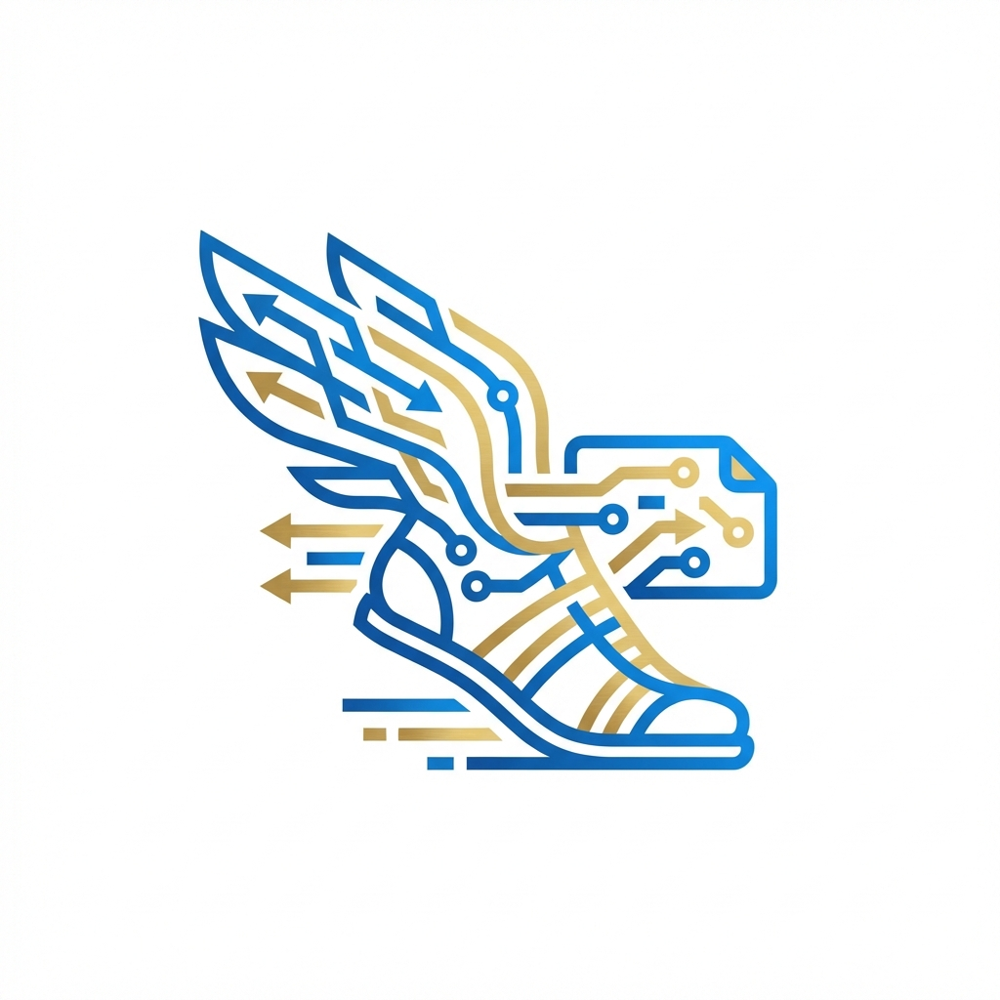
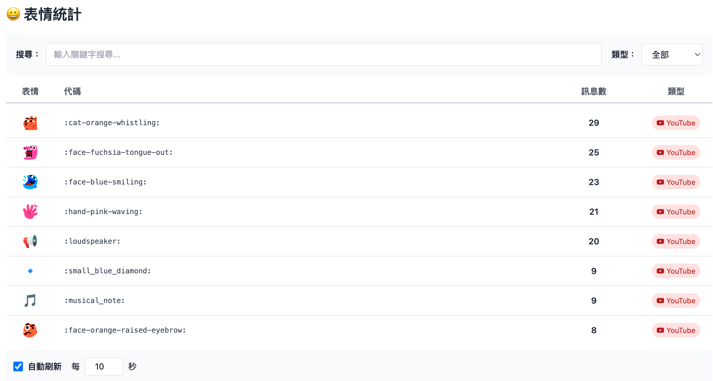
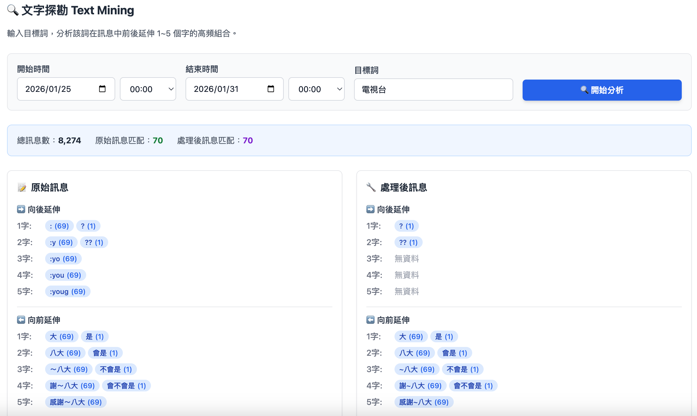
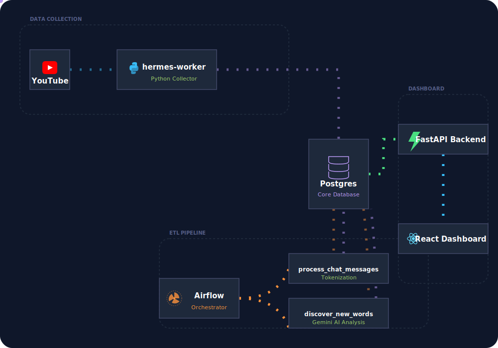

<p align="center">
  
</p>

<h1 align="center">YouTube Live Chat Analyzer</h1>

<p align="center">
  <strong>YouTube Live Stream Chat Collection & Analysis System</strong>
</p>

<p align="center">
  <a href="#"></a>
  <a href="#"></a>
  <a href="#"></a>
  <a href="#"></a>
  <a href="#"></a>
  <a href="#"></a>
  <a href="#"></a>
</p>

---

## 🪽 What is YouTube Live Chat Analyzer?

**YouTube Live Chat Analyzer** is a complete data pipeline for collecting, processing, and visualizing YouTube live stream chat messages in real-time.

The system captures chat messages from live streams, processes them through NLP pipelines (Chinese tokenization, emoji extraction), and uses **Gemini AI** to automatically discover new slang, memes, and typos from the community.

<p align="center">
  
</p>

---

## ✨ Features

| Feature | Description |
|---------|-------------|
| 📥 **Real-time Collection** | Capture live chat messages using `chat-downloader` with automatic retry & reconnection |
| 🔄 **ETL Processing** | Chinese tokenization with Jieba, emoji extraction, word replacement pipelines |
| 🤖 **AI-Powered Discovery** | Gemini API (`gemini-2.5-flash-lite`) analyzes chat to discover new memes, slang, and typos automatically |
| 📊 **Interactive Dashboard** | React-based dashboard with word cloud, playback timeline, and admin management |
| 📈 **Word Trend Analysis** | Track specific word usage trends over time with customizable word groups |
| 🛠️ **Admin Panel** | Approve/reject AI-discovered words, manage dictionaries, configure settings |
| 🔐 **Role-based Access** | JWT-based authentication with Admin/Guest roles for secure admin operations |

## 📸 Gallery

| ⚡ Real-time Analytics | ☁️ Word Cloud |
|:---:|:---:|
|  |  |

| 🤣 Emoji Statistics | 🛠️ Admin Text Mining |
|:---:|:---:|
|  |  |

---

## 🏗️ Architecture

<p align="center">
  <!-- TODO: Update Architecture Diagram with new service names -->
  
</p>

---

## 🚀 Quick Start

### Prerequisites

- Docker & Docker Compose
- YouTube Data API Key
- Gemini API Key (for AI word discovery)

### Setup

```bash
# 1. Clone the repository
git clone https://github.com/GallonShih/youtube-live-chat-analyzer.git
cd youtube-live-chat-analyzer

# 2. Configure environment variables
cp .env.example .env
# Edit .env and set:
# - YOUTUBE_API_KEY: Your YouTube Data API Key
# - GEMINI_API_KEY: Your Google AI API Key (for discovery DAG)
# - YOUTUBE_URL: The full URL (or ID) of the live stream you want to track
# - ADMIN_PASSWORD: Password for admin access
# - JWT_SECRET_KEY: Secure random key for JWT tokens

# 3. Generate a secure JWT secret key
python3 -c "import secrets; print(secrets.token_hex(32))"
# Copy the output to JWT_SECRET_KEY in .env

# 4. Start all services
docker-compose up -d

# 5. Access the dashboard
open http://localhost:3000
```

> 📖 **First-time setup?** See [docs/SETUP.md](docs/SETUP.md) for detailed configuration. **Important:** You must manually trigger the **Import Dictionary** task in the Admin Panel after deployment to enable proper text analysis.

---

## 🔌 Services

| Service | Port | Description |
|---------|------|-------------|
| **Dashboard Frontend** | `3000` | React-based visualization & admin UI |
| **Dashboard Backend** | `8000` | FastAPI REST API with built-in ETL scheduler (`/docs` for Swagger) |
| **PostgreSQL** | `5432` | Primary data storage |
| **pgAdmin** | `5050` | Database administration UI |

---

## 📁 Project Structure

```
youtube-live-chat-analyzer/
├── collector/           # Chat collection service (Python)
│   ├── main.py          # Entry point: coordinates collection & stats polling
│   ├── chat_collector.py# Real-time chat message collection
│   └── youtube_api.py   # YouTube Data API integration
│
├── dashboard/
│   ├── backend/         # FastAPI REST API with built-in ETL scheduler
│   │   ├── app/routers/ # API endpoints (chat, wordcloud, admin, etl, etc.)
│   │   ├── app/etl/     # APScheduler-based ETL tasks
│   │   │   ├── processors/  # Chat processing, word discovery, dict import
│   │   │   ├── scheduler.py # Task scheduling
│   │   │   └── tasks.py     # Task definitions
│   │   └── app/models.py    # SQLAlchemy models
│   └── frontend/        # React + Vite + TailwindCSS
│       └── src/features/    # Feature-based components
│           ├── admin/       # Admin panel (ETL jobs, settings, word approval)
│           ├── playback/    # Timeline-based message playback
│           └── trends/      # Word trends analysis UI
│
├── airflow/             # [DEPRECATED] Legacy Airflow DAGs (see docs/legacy/)
│
├── database/
│   └── init/            # SQL migrations (auto-executed on first start)
│
├── text_analysis/       # NLP dictionaries (stopwords, special words, etc.)
│
├── .github/workflows/   # CI/CD pipeline (tests, build, deploy)
│
├── docker-compose.yml   # Full stack orchestration
├── .env.example         # Environment variables template
└── CLAUDE.md            # AI agent development guide
```

---

## 🛠️ Development

For detailed development commands and guidelines, see [CLAUDE.md](./CLAUDE.md).

```bash
# View logs
docker-compose logs -f collector

# Rebuild a specific service
docker-compose up -d --build dashboard-backend

# Access database
docker-compose exec postgres psql -U hermes -d hermes
```

### Frontend Unit Tests (Local, no Docker required)

Frontend tests use `Vitest + React Testing Library + MSW` and run directly on local Node.js.

```bash
cd dashboard/frontend

# Install dependencies
npm install

# Run tests once
npm run test:run

# Or watch mode during development
npm run test:watch
```

Current test focus includes:
- Author detail UI rendering (avatar/badges)
- Message rendering (emoji + paid amount)
- Error handling for author detail API
- Dashboard author drawer interaction flow

---

## 📄 License

MIT License - see [LICENSE](./LICENSE) for details.
